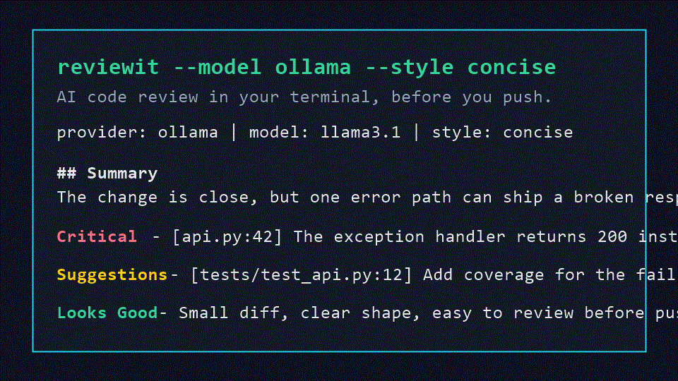

<p align="center">
  
</p>

# reviewit

[](https://pypi.org/project/reviewit/)
[](https://www.python.org/)
[](LICENSE)
[](https://github.com/SidChellappan/ReviewIt)

AI code review in your terminal, before you push.

```bash
pip install reviewit
reviewit init
git add .
reviewit
```

`reviewit` reads your git diff, sends it to your chosen model, and streams back a structured review with critical issues, suggestions, and positives. It supports hosted models through OpenAI and Anthropic, plus fully local reviews with Ollama for offline and privacy-conscious workflows.

## Features

| Capability | Status |
|---|---|
| OpenAI GPT review | Built in |
| Anthropic Claude review | Built in |
| Ollama local review | Built in |
| Concise or detailed output | Built in |
| Security, performance, and junior profiles | Built in |
| `.reviewit.rules` repo guidance | Built in |
| Pre-push hook installer | Built in |

## Usage

Review all changes against `HEAD`:

```bash
reviewit
```

Review only staged changes:

```bash
reviewit --staged
```

Use Ollama for a local review:

```bash
reviewit --model ollama
```

Ask for a deeper review:

```bash
reviewit --style detailed
```

Focus the review:

```bash
reviewit --profile security
reviewit --profile performance
reviewit --profile junior
```

Install the pre-push hook:

```bash
reviewit install-hook
```

The hook compares your branch against its upstream when one exists, then blocks the push if the model request fails.

## Configuration

`reviewit init` writes `~/.reviewit.toml`.

```toml
default_model = "gpt"
default_style = "concise"

[openai]
api_key = "sk-..."
model = "gpt-4o"
base_url = "https://api.openai.com/v1"

[anthropic]
api_key = "sk-ant-..."
model = "claude-3-5-sonnet-latest"
base_url = "https://api.anthropic.com"

[ollama]
host = "http://localhost:11434"
model = "llama3.1"
```

Environment variables work too:

```bash
export OPENAI_API_KEY="sk-..."
export ANTHROPIC_API_KEY="sk-ant-..."
export OLLAMA_HOST="http://localhost:11434"
```

## Repo Rules

Add `.reviewit.rules` at the root of a repo to include team-specific checks in every review.

```toml
always_check = [
  "all API calls must handle errors",
  "never log secrets or tokens",
  "new public functions need tests"
]
```

## Development

```bash
python -m pip install -e ".[dev]"
pytest
ruff check .
```

## Why reviewit?

The best code review is the one you run before the branch leaves your machine. `reviewit` is intentionally small: no server, no database, no hosted dashboard. It is just your diff, your rules, and the model you choose.

## Contributing

Issues and pull requests are welcome. Keep changes focused, include tests for behavior changes, and prefer small provider-specific fixes over broad rewrites.
